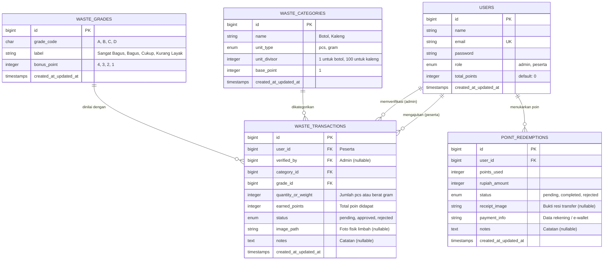

# Entity Relationship Diagram (ERD)

Seluruh entitas saling terhubung menggunakan *Foreign Key* dengan integritas referensial penuh di MySQL.


```mermaid
erDiagram
    USERS ||--o{ WASTE_TRANSACTIONS : "mengajukan (peserta)"
    USERS ||--o{ WASTE_TRANSACTIONS : "memverifikasi (admin)"
    USERS ||--o{ POINT_REDEMPTIONS : "menukarkan poin"
    WASTE_CATEGORIES ||--o{ WASTE_TRANSACTIONS : "dikategorikan"
    WASTE_GRADES ||--o{ WASTE_TRANSACTIONS : "dinilai dengan"

    USERS {
        bigint id PK
        string name
        string email UK
        string password
        enum role "admin, peserta"
        integer total_points "default: 0"
        timestamps created_at_updated_at
    }

    WASTE_CATEGORIES {
        bigint id PK
        string name "Botol, Kaleng"
        enum unit_type "pcs, gram"
        integer unit_divisor "1 untuk botol, 100 untuk kaleng"
        integer base_point "1"
        timestamps created_at_updated_at
    }

    WASTE_GRADES {
        bigint id PK
        char grade_code "A, B, C, D"
        string label "Sangat Bagus, Bagus, Cukup, Kurang Layak"
        integer bonus_point "4, 3, 2, 1"
        timestamps created_at_updated_at
    }

    WASTE_TRANSACTIONS {
        bigint id PK
        bigint user_id FK "Peserta"
        bigint verified_by FK "Admin (nullable)"
        bigint category_id FK
        bigint grade_id FK
        integer quantity_or_weight "Jumlah pcs atau berat gram"
        integer earned_points "Total poin didapat"
        enum status "pending, approved, rejected"
        string image_path "Foto fisik limbah (nullable)"
        text notes "Catatan (nullable)"
        timestamps created_at_updated_at
    }

    POINT_REDEMPTIONS {
        bigint id PK
        bigint user_id FK
        integer points_used
        integer rupiah_amount
        enum status "pending, completed, rejected"
        string receipt_image "Bukti resi transfer (nullable)"
        string payment_info "Data rekening / e-wallet"
        text notes "Catatan (nullable)"
        timestamps created_at_updated_at
    }
```

```